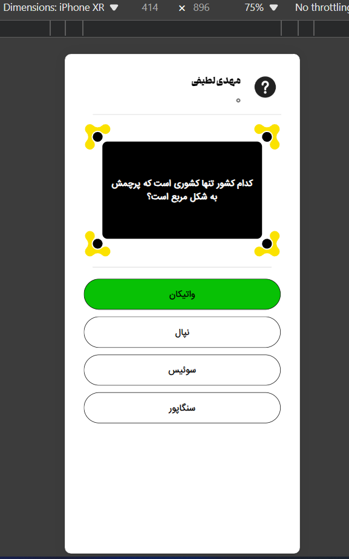
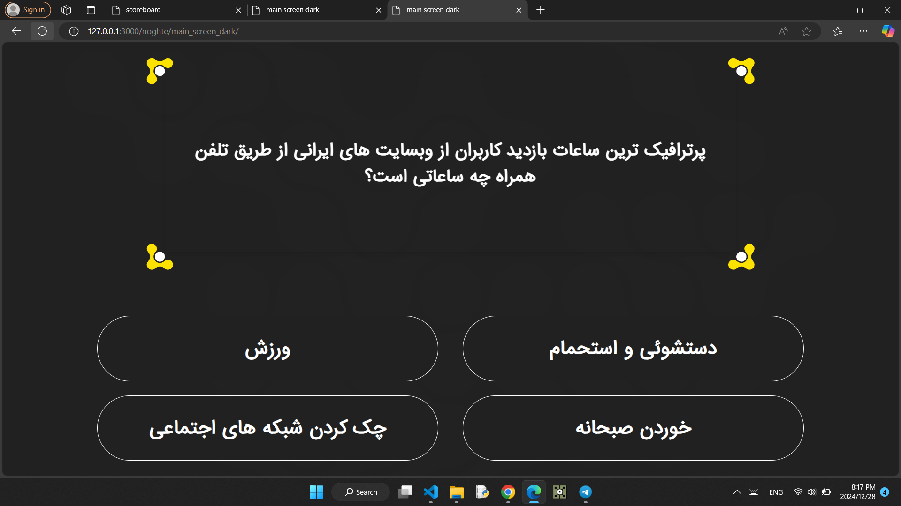
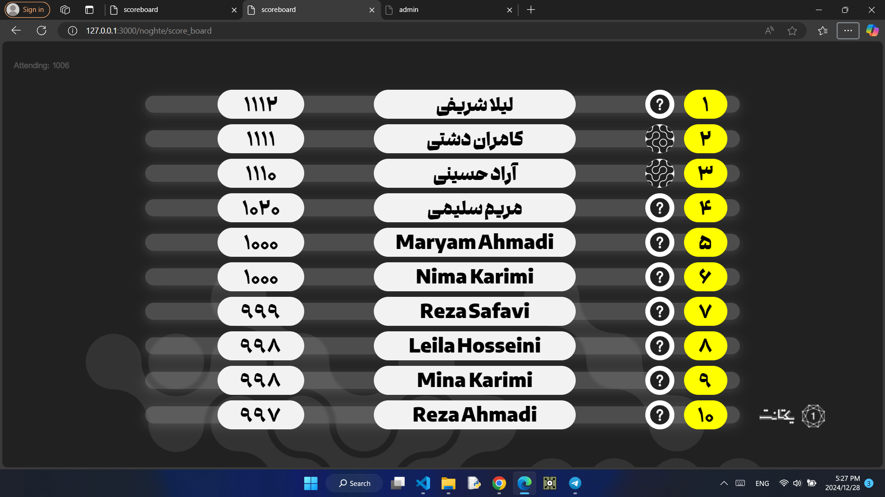
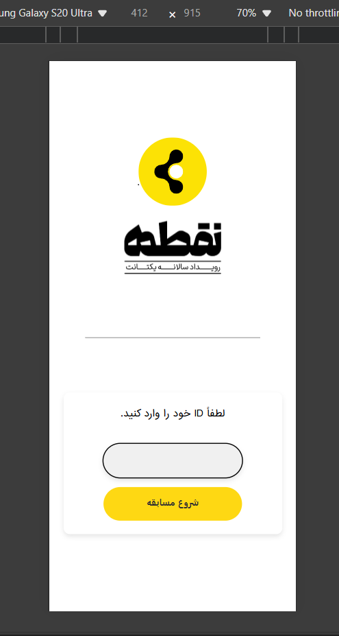

# 🎮 Live Quiz Game – Showcase

This is a web-based **Live Quiz Game** developed as a fun and interactive experience where participants can join, answer timed questions, and compete in real-time on a dynamic scoreboard.

> 🧪 Created as a demo project for **Yektanet**.

---

## 🌐 Live Demo

👉 [Click here to try the live demo](https://yektanetgame.mml-dev.ir/noghte/user/)

👉 [Question screen](https://yektanetgame.mml-dev.ir/noghte/main_screen_dark/)

👉 [Scoreboard](https://yektanetgame.mml-dev.ir/noghte/score_board/)

---

## 📸 Screenshots

### 🖥️ Question Screen mobile

### 🖥️ Question Screen LEDWall

### 🏆 Scoreboard Screen

### 📱 Mobile Login Page

---

## 🛠️ Tech Stack

- **Frontend**: HTML, CSS, JavaScript
- **Backend**: PHP 
- **Database**: MySQL
- **Real-time Updates**: AJAX + polling every second
- **Hosting**: Cloud-based (suitable for 1000+ users)

---

## 📌 Notes

- All participants get questions at once.
- Answers are submitted individually via fast API calls.
- Score updates every second in real-time.
- Separate display pages for scoreboard and questions.

---

